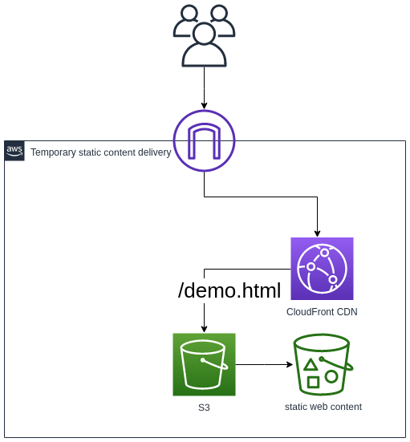
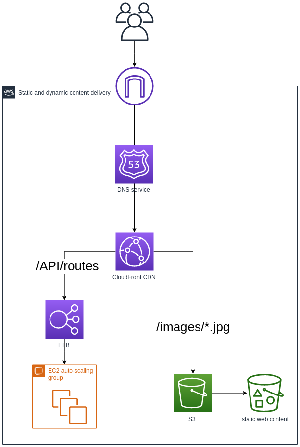

# AWS SA Homework

Hello! Terve!

I've created an updated version of the CloudFormation YAML to quick-fix the current placeholder static website deployment `AWS-SA-Vitek-Urbanec-simplest.yaml` _(just upload the template and build the stack, wait for the instance and ELB to come up and you're all set)_, please see the further comments for the requested action points and more detailed information.

Regarding the architectural recommendations: Since you're in the early stages of the app development and not much is known about where you're going to go with it, I suggest we look at the high-level options first without going into detail. The infrastructure should be built to fit your app, not the other way around.

_a) Troubleshoot the implementation by doing the minimum amount of work required to make the web
site operational. Your customer expects detailed written troubleshooting instructions or scripts for the in-house team._

- The LoadBalancer was only associated with Public Subnet B, which is empty. Solution is either to add the Public Subnet A (which contains the only EC2 instance NIC) to the list associated with the ELB, or replacing Public Subnet B with A. Since the "minimum work" requirement, latter option was chosen.

- The LoadBalancer needs to be set as "internet-facing" so the DNS record resolves to a public IP, so it can serve the static web content.

```
SAelb:
      Type: AWS::ElasticLoadBalancing::LoadBalancer
      Properties:
        Subnets: [!Ref 'PublicSubnetA'] #changed to the Public Subnet A where the only instance is residing
        Instances: [!Ref 'SAInstance1']
        SecurityGroups: [!Ref 'SASGELB']
        Scheme: 'internet-facing' #set the LB configuration to "internet facing"
```

- The HealthCheck for the instance needs to be either set to HTTP, or HTTPS traffic needs to be configured. Considering the fact that a SSL Cert authority is not set up yet, I went for the HTTP healthcheck.

```        
        HealthCheck:
          HealthyThreshold: '2'
          Interval: '15'
          Target: TCP:80 #selected HTTP   healthcheck to match the listener
          Timeout: '5'
          UnhealthyThreshold: '2'
```

- Security groups for both the LoadBalancer and the App Server had to be modified to allow ingress HTTP traffic. New ELB group rule allows ingress traffic from the Gateway, the App Server group rule allows ingress traffic from the VPC CIDR.

```
    SASGELB:
      Type: AWS::EC2::SecurityGroup
      Properties:
        GroupDescription: SA Assignment - ELB security group
        VpcId: !Ref 'SAVPC'
        SecurityGroupIngress: #add ingress rule for HTTP traffic to be allowed
        - CidrIp: 0.0.0.0/0
          FromPort: 80
          IpProtocol: tcp
          ToPort: 80
        Tags:
          - Key: environment
            Value: sa-assignment
          - Key: Name
            Value: ELBSecurityGroup

    SASGapp:
      Type: AWS::EC2::SecurityGroup
      Properties:
        GroupDescription: SA Assignment - App server security group
        VpcId: !Ref 'SAVPC'
        SecurityGroupIngress: #add ingress rule for HTTP traffic to be allowed from VPC CIDR
        - CidrIp: 10.0.0.0/16
          FromPort: 80
          IpProtocol: tcp
          ToPort: 80
        Tags:
          - Key: environment
            Value: sa-assignment
          - Key: Name
            Value: AppServerSecurityGroup
```

_b) Propose short term changes you could help them implement to improve the availability, security,
reliability, cost and performance before the project goes into production. Your customer expects you to
explain the business and technical benefits of your proposals, with artifacts such as a design or
architecture document and diagrams._

Short term production environment recommendations:
- until the dynamic content is production ready, let's serve the static content using simply an S3 bucket with HTTPS access configured using CloudFront CDN. 
It's easy to set up and cost effective. I recommend this as the go-to solution for the time being.



- should you choose going forward with the current infrastructure even for serving static content, I have these recommendations:
    - Enable HTTPS by configuring a SSL Cert authority
    - Consider adding another EC2 instance into Public Subnet B (in the separate availability zone (AZ)) for additional availability and add/register the subnet and instance with the LoadBalancer
    - depending on the traffic, consider creating an auto-scaling group to register with the LoadBalancer to accomodate traffic peaks
    - Remove the unused resources (subnets, etc.) to reduce complexity


Please consider what Service Level Objectives do you want to set for the placeholder static content, extending to multiple AZ and auto-scaling is not the most effective use of resources.


_c) Optionally, propose high level alternative solution(s) for the longer term as their web application
becomes more successful._



Adding your own domain with Route 53 DNS service:
- using your own domain instead of the autogenerated AWS DNS records will look a lot better

Adding the dynamic component:
- if you go with my previous recommendation to serve the static content via S3/CloudFront, you'll be able to decouple the web app so the EC2 (or EKS) compute resources will be used exclusively for the dynamic part of the app (APIs, etc.)
- we'll be able to route requests for ie. images to the S3, while requests for the dymanic part of the app will be routed to compute resources or AWS services.
- the compute component of course doesn't have to be EC2 instances, I'm using it here since you're already familiar with it. We'll be looking into ways of making the compute as efficient as possible with containers and serverless.

Build CI/CD pipeline:
- you'll enable the teams to deliver new features faster and more realiably via a CI/CD pipeline.
- no more using the CloudFormation GUI in the AWS console to deploy your stack, that's a good thing!


Introducing non-prod environments:
- for the development of the dynamic content, I recommend setting up a QA (Quality Assurance) and possibly STG (Staging) environment
-  These will enable your dev teams to do thorough functional and performance testing before deploying to the production


Consider the amount of traffic that's going to be hitting the static and dynamic content of the web app - and relevant SLOs/SLAs for the content, so we can choose a fitting infrastructure.

Let's discuss the possibilities face to face at our next meeting.